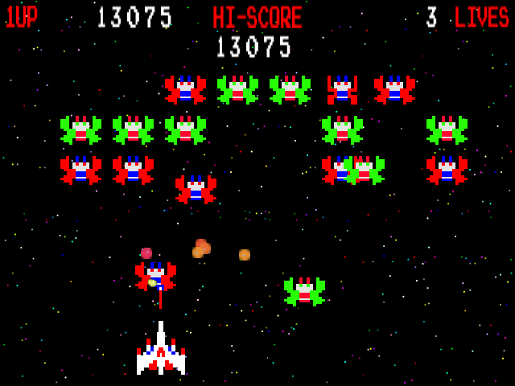

# Rest API Todo List

## Description
We are going to make a nice open todo list application. For testing and viewing use postman.

## Requirements
* Create a new gradle project with Spring Initializr include devtools, web, jpa, postgres, h2, jpa
* Add needed properties to `application.properties` to make the database work
* Create a user entity which will be stored in the postgres database
	* id
	* username
	* password
	* email
	* firstName
	* lastName
* Create a CRUD controller for the User entity
	* All endpoints will start with `/users/`
	* Creation will take a plain text password that the backend will hash before saving
	* No need to ever allow the user to change their password in this mode
* Create a todo list item entity with the following
	* id
	* title
	* description
	* due date
	* user
* Create the CRUD end points for the todo list items
	* All todo list items will be added via urls starting with `/{userId}/todos/`
	* Make sure that the system returns the appropriate 404 error message if the user is not found

## Hard Mode
* Using AJAX create a front end with JQuery and HTML
	* Have one page that will allow for listing all of the users
		* Allow the page to create a new user
	* Each user should have a detail page
		* Page will display the user's information
		* Page should have a delete button.
		* Page should have a simple form that allows for creation of a new todo list item
		* Page should list off the TODO list items for that user
	* Each todo list item should link to a detail page for that item
		* Page will display the user's name at the top and link it to the user detail page		
		* Allow the user to delete
		* Allow the user to edit the todo list item

## Nightmare Mode
* Style the page with CSS
* Make the forms for creation of items and users collapsable so that they are only displayed on a action like someone clicking a link

## Resources
* [Github Repo](https://github.com/tiy-lv-java-2016-11/todo-api)
* [Spring Guide: Restful Web Service](https://spring.io/guides/gs/rest-service/)
